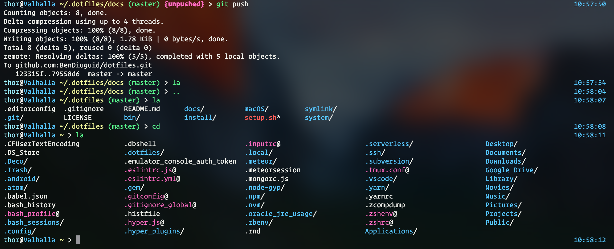

# Ben Diuguid's dotfiles

For more information on dotfiles checkout [dotfiles.github.io](http://dotfiles.github.io/)

Follow me on Twitter: [@BenDiuguid](https://twitter.com/BenDiuguid)

Follow me on Medium: [@BenDiuguid](https://medium.com/@BenDiuguid)

## Overview

### Why dotfiles?
* dotfiles provide an easy solution for setting up your dev environment with one command.
* Backup, restore, and sync the prefs and settings for your toolbox. Your dotfiles might be the most important files on your machine.
* Learn from the community. Discover new tools for your toolbox and new tricks for the ones you already use.
* Share what you've learned with the rest of us.

### Setup
To setup these dotfiles, simply clone this repo then cd into it and execute `./setup.sh`. You can also simply paste the following command into terminal, which will switch to the home directory, clone the repo into `~/.dotfiles/`, make the setup script executable, and then run the setup script with bash.

Copy and Paste into terminal: `cd ~/ && git clone https://github.com/bendiuguid/dotfiles .dotfiles && cd .dotfiles && chmod +x setup.sh && ./setup.sh`

## File System

    ├── bin
    │   └── dotfiles                - Executable placed on path to provide dotfiles update/editting shortcuts
    │
    ├── install
    │   ├── atom.sh                 - Uses apm to install atom packages/themes
    │   ├── bash.sh                 - Gets bash/completions from brew and makes it default shell
    │   ├── brew-cask.sh            - Installs GUI apps
    │   ├── brew.sh                 - Installs command line apps
    │   ├── gem.sh                  - Installs useful ruby gems
    │   ├── mac.sh                  - Installs mac applications through the App Store
    │   ├── meteor.sh               - Installs meteor
    │   ├── npm.sh                  - Globally installs useful npm packages
    │   ├── python.sh               - Installs useful python packages
    │   └── zsh.sh                  - Gets zsh/completions from brew and makes it default shell
    │
    ├── macOS
    │   ├── defaults.dock.sh        - Sets the Dock up
    │   └── defaults.sh             - Skinned down version of mathiasbynens/dotfiles/.macOS
    │
    ├── symlink
    │   ├── .eslintrc.js            - Global eslint config
    │   ├── .gitconfig              - Global git config, where user info and git alias's live
    │   ├── .gitignore_global       - Global gitignore
    │   ├── .hyper.js               - hyper.app config
    │   ├── .tmux.conf              - tmux config
    │   ├── .zshenv
    │   └── .zshrc
    │
    └── system
        ├── .alias                  - Shell Alias's
        ├── .completion             - Shell completions
        ├── .env                    - Environmental variables
        ├── .nvm                    - Properly sources nvm
        ├── .path                   - Defines the path
        └── .prompt                 - Logic for prompt coloring + git status of prompt

### Screenshots

## Caveats
Currently I have not tested this on anything other than macOS.

# Happy Hacking!
